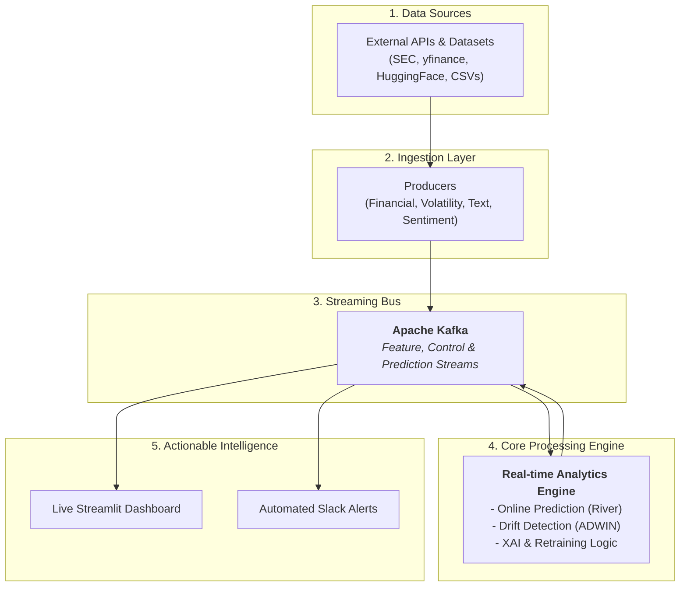

# **FDA-8-Stream: A Real-Time M&A Prediction Pipeline**

This repository contains the source code for FDA-8-Stream, a real-time predictive analytics system designed to identify companies with a high likelihood of engaging in Mergers & Acquisitions (M&A). The system leverages a modern streaming architecture, integrating Apache Kafka for data ingestion, the River library for online machine learning, and drift detection algorithms from the CapyMOA family to ensure continuous model adaptation.

---

## **Features**

*   **End-to-End Streaming:** Fully automated pipeline from data source to final insight.
*   **Live API Integration:** Ingests real-time data from SEC EDGAR, yfinance, and HuggingFace APIs.
*   **Advanced Online ML:** Uses a **Stacked Ensemble** model with River for sophisticated, real-time prediction on multimodal data.
*   **Drift-Adaptive Learning:** Automatically detects concept drift using **ADWIN** and triggers a closed-loop retraining of the predictive model to ensure long-term accuracy.
*   **Real-Time Explainable AI (XAI):** A dedicated consumer tracks and visualizes evolving feature importances, providing transparency into the model's decision-making.
*   **Interactive Dashboard:** A multi-tab Streamlit dashboard for live monitoring of predictions, feature importances, and drift events.
*   **Automated Slack Alerts:** Sends instant notifications for high-probability M&A events and critical data drift alerts.

---

## **System Architecture**

The pipeline is architected as a decoupled, event-driven system with Apache Kafka at its core. Producers ingest data from external sources, which is then processed in parallel by a suite of specialized analytical consumers. The final insights are delivered to a dashboard and Slack.


<details>
<summary>Click to view Mermaid Code for Architecture Diagram</summary>



</details>

---

## **Quick Start & Setup**

Follow these steps to set up and run the entire pipeline.

### **1. Prerequisites**

*   **Apache Kafka:** A working Kafka installation is required. This project is configured for a local installation at `~/kafka`.
*   **Python 3.8+:** A modern version of Python is needed.

### **2. Installation & Configuration**

1.  **Clone the Repository:**
    ```bash
    git clone https://github.com/Rishab-Bo/Stream-MA-Prediction-Pipeline
    cd <your-repo-directory>
    ```

2.  **Create a Python Virtual Environment:**
    ```bash
    python -m venv venv
    source venv/bin/activate
    ```

3.  **Install Dependencies:**
    *(A `requirements.txt` file should be created for this step, containing all libraries below)*
    ```bash
    pip install kafka-python river pandas scikit-learn streamlit streamlit-autorefresh plotly requests yfinance
    ```

4.  **Configure Environment Variables:**
    Copy the template `.env` file and fill in your API keys.
    ```bash
    cp config/template.env .env
    ```
    Now, edit the `.env` file with your details:
    ```dotenv
    # .env
    KAFKA_BROKER=localhost:9092
    BASE_DIR=/path/to/your/project/folder # IMPORTANT: Use the absolute path

    # API Keys & URLs
    HF_TOKEN="hf_YourHuggingFaceToken"
    SLACK_WEBHOOK_URL="https://hooks.slack.com/services/Your/Slack/Webhook"
    SEC_USER_AGENT="YourName YourEmail@example.com" # Required by SEC
    ```

### **3. Running the Pipeline (Full Workflow)**

Follow these steps in order to run the pipeline from a clean state.

1.  **Run Kafka Setup (One-Time):**
    This script formats the KRaft storage and creates all the necessary Kafka topics.
    ```bash
    bash kafka_setup.sh
    ```

2.  **Generate Datasets:**
    This creates the `fda8_*_dataset.csv` files used by the producers in `dataset` mode and for the initial model training.
    ```bash
    python data/generate_dataset.py
    ```

3.  **Perform Initial Model Training (CRITICAL):**
    This trains the first version of the predictive model, ensuring the pipeline doesn't start "cold" and can make intelligent predictions immediately.
    ```bash
    python initial_train.py
    ```

4.  **Run the Full Pipeline:**
    This script starts all producers and consumers. The mode can be `dataset`, `api`, or `synthetic`. The `api` mode is recommended for live data.
    ```bash
    bash run_pipeline.sh api
    ```

5.  **View the Dashboard:**
    Open your web browser and navigate to **`http://localhost:8501`**.

### **4. Demo Mode**

To showcase the system's alerting capabilities in a controlled manner, use the dedicated demo script. This will automatically start the consumers and then run a special producer to trigger a drift alert followed by a high-M&A-probability alert.

```bash
# Ensure you have completed steps 1-3 from the full workflow above first.
bash run_demo.sh
```

### **5. Stopping & Resetting**

*   **To stop all pipeline processes:**
    ```bash
    bash stop_pipeline.sh
    ```

*   **To perform a full reset** (wipes all logs, data, models, and Kafka topics):
    ```bash
    bash reset_pipeline.sh
    ```

---

## **Troubleshooting**

*   **Predictions are stuck at 0.5:** This means the model is untrained. You must run the `initial_train.py` script before starting the pipeline.
*   **Slack alerts are not being sent:**
    *   Check that your `SLACK_WEBHOOK_URL` in the `.env` file is correct.
    *   Ensure the `slack_alert_consumer.py` process is running (`ps aux | grep slack`).
*   **Producers in API mode fail:**
    *   Verify your `HF_TOKEN` is correct.
    *   Ensure you have set a valid `SEC_USER_AGENT` as required by the SEC.
*   **Kafka connection errors:**
    *   Make sure your Kafka server is running.
    *   Check that `KAFKA_BROKER` in your `.env` file is set to the correct address (e.g., `localhost:9092`).

```
